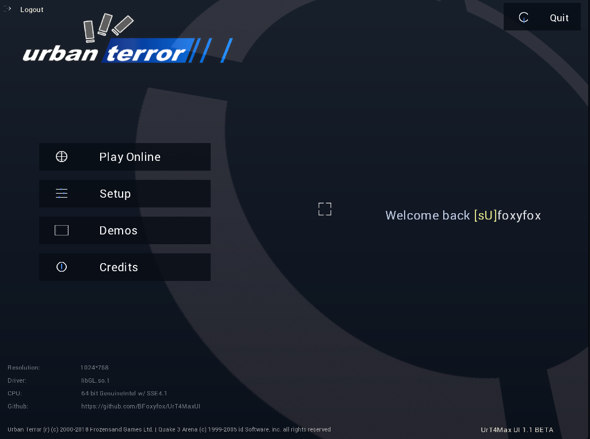

# UrT4Max UI

A visual overhaul for the Urban Terror 4.3.4 interface, with a modernized style, consistent menu design, and a packaging workflow to distribute a custom `.pk3` without modifying original game archives.

## Goal

- Modernize the stock UrT 4.3.4 UI
- Keep client-side gameplay compatibility
- Distribute the theme easily through a single `pk3`

## Preview

  

## What changed compared to the original UI

- Unified color palette (inspired by home screen / joinserver)
- Restyled in-game and main menu visuals
- Readability improvements (text, alignment, spacing)
- Harmonized button and hover behavior
- Custom UI sound
- Custom UI colors
- New color customization menu with live preview
- Theme presets plus per-slot color control:
  - Background Tint
  - Button Normal
  - Button Hover
  - Button Selected
  - Text / Icon Color
  - Table Panels

## Packaging / Distribution

The pack is generated as a `.pk3` (default: `zzz_urt4maxui_v1_1_beta.pk3`) including:

- `ui/...`
- `sound/misc/...`

The objective is to distribute one file to copy into `q3ut4/`.

## Tip
On first launch, a popup appears once to initialize the default theme.
Click the panel to apply default colors and save them to config.
Then you can fully customize the UI in Setup > Interface.

## Important warning (Scoreboard)

> The custom **scoreboard is not compatible on servers running `sv_pure 1`**.

On `sv_pure 1` servers, the client can be forced to use server-approved assets, which may restore the stock scoreboard (or ignore some custom UI elements).

## Quick install

1. Close the game.
2. Copy the generated `.pk3` into `q3ut4/`.
3. Launch the game.
4. If old menu data is still shown: fully restart the client.

## Compatibility

- Base: Urban Terror 4.3.4
- Tested platform: Linux
- Behavior may vary depending on server settings (`sv_pure`)

## Credits

UI project: **BFoxyfox / UrT4MaxUI**

Added/replaced UI sounds: **pixabay.com**

Repository: https://github.com/BFoxyfox/UrT4MaxUI
